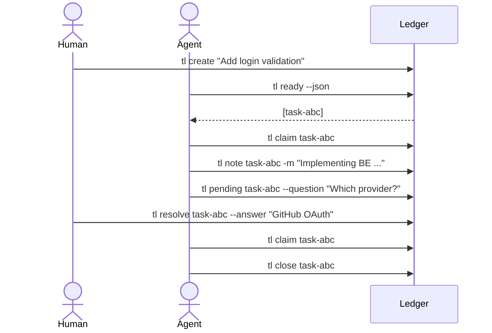

# PRD: task ledger tool

**Task ledger** (`tl`) is a Git-native task ledger (tool) for humans and AI coding agents.

This document captures design intent — the parts of the spec that are not
derivable from code, features, or the README. For per-command behavior read
the [`features/`](../features) directory; for flags read

## Core product thesis

A good human and  agent task system should be:

1. **Repo-local** - state lives in the Git repository.
2. **Human-readable** - as backup developer can edit tasks with a normal editor.
3. **Machine-readable** - every read command supports `--json`.
4. **Dependency-aware** - agents can ask "what is ready now?".
5. **Claim-safe** - claims have leases with stale-claim detection.
6. **Handoff-oriented** - notes preserve context between humans and agents or just between agents
7. **Small and predictable** - no daemon, no hidden database, no automatic remote push.

---

## 4. Non-goals

`tl` will not initially support:

- A web app or hosted backend.
- Complex role hierarchies.
- Multi-repository orchestration.
- Automatic Git pushing or merging.
- Long-running background workers.
- AI agent execution itself.
- Compete with feature richnes or workflow of Jira / Linear / etc.

The tool tracks and coordinates work. It does not run the agent in v1.

## Key differentiator

The strongest differentiator is not "file-based tasks". It is:

> **Agent-safe task coordination with readable Git-native state.**

That means:

- Claims are explicit.
- Stale work is detectable.
- Dependencies are computable.
- Handoffs are recorded.
- Humans can inspect everything.

## Workflow reasoning

An example full collaboration loop - including a handoff back to the human when the
agent needs a decision could looks like this:

